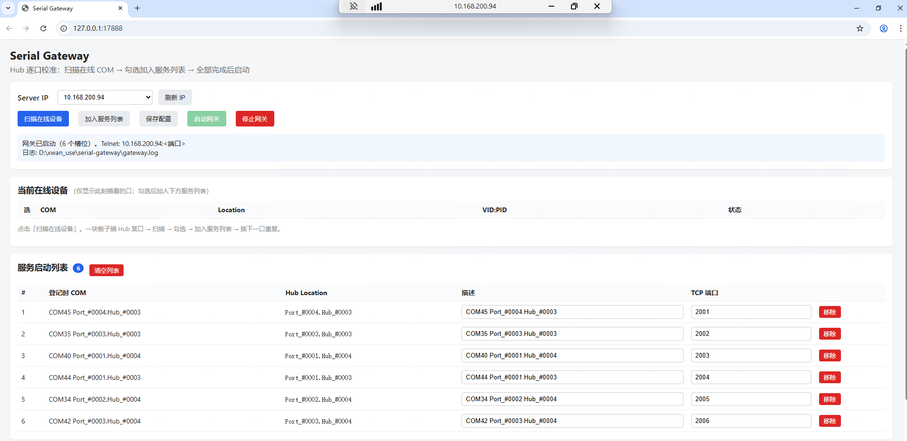
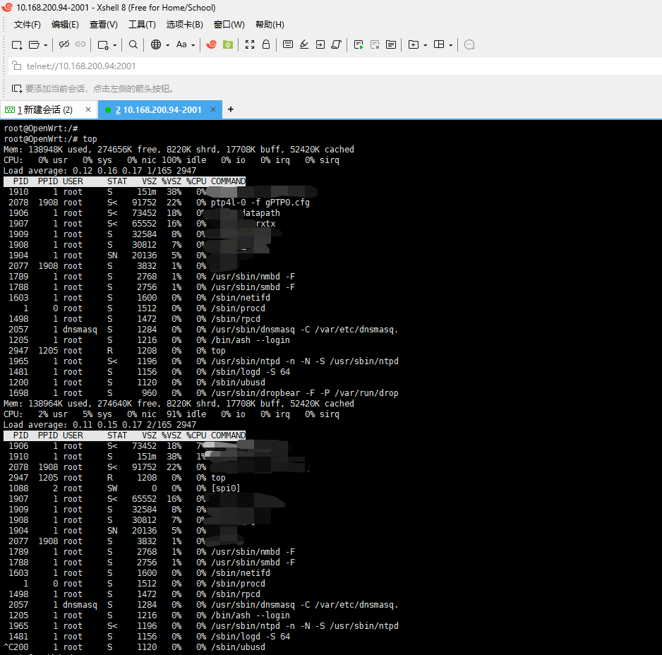

# Serial Gateway

[中文](#项目简介) | [English](#english)

> **特别说明**：本项目**免费开源**，由 **纯 AI** 辅助实现。目前 **Xshell** 终端连接功能正常，**其他终端客户端可能存在兼容问题**。使用中遇到问题欢迎反馈，也欢迎 **Clone** 并改进代码。
>
> **Notice**: This project is **free and open source**, built with **AI-assisted** development. **Xshell** works reliably today; **other terminal clients may have compatibility issues**. Feedback is welcome—feel free to **clone** and improve the code.

---

基于 **Go** 实现的 **Windows** 串口网关服务：将 USB HUB 扩展出的 COM 端口映射为固定 TCP 端口，客户端通过 `telnet <IP> <端口>` 即可访问对应串口，无需在设备管理器里反复查找 COM 号。

## 项目简介

嵌入式开发板通过 USB 串口插入 HUB，主机运行 Serial Gateway 后，把每个 HUB 物理口位（Hub Location）绑定到网络端口。远程或本机使用 Telnet、PuTTY、Xshell 等工具连接 `IP:端口`，效果等同于直连该 COM 口。

典型拓扑：

```
[开发板 USB 串口] ──► [USB HUB 固定口位] ──► [Windows 主机 COM] ──► [Serial Gateway] ──► TCP 2001/2002/...
                                                                                              │
                                                                                              ▼
                                                                              [Telnet 客户端 / 远程调试]
```

## 核心优势

| 优势 | 说明 |
|------|------|
| **低成本** | 仅需一台 Windows 电脑 + 廉价 USB HUB，无需专用串口服务器硬件 |
| **固定映射** | 按 HUB 物理口位（`Port_#xxxx.Hub_#xxxx`）登记，COM 号变化也不影响 TCP 端口对应关系 |
| **远程调试** | 串口暴露为网络服务，便于远程环境、虚拟机或同事协同连接 |
| **多路并发** | 一个 HUB 多口同时映射，支持多板卡、多用户各自连接不同 TCP 端口 |
| **省时省心** | 记住 `IP:2001` 即可，不必每次插拔后重新确认 COM 端口号 |

## 界面与使用示例

### Web 管理界面

启动 `serial-gateway.exe` 后自动打开浏览器控制台，完成 HUB 逐口校准、端口分配与网关启停：



操作流程：**扫描在线设备** → 勾选 COM → **加入服务列表** → **保存配置** → **启动网关**。

### Telnet 连接串口

网关启动后，客户端连接 `telnet://<ServerIP>:<TCP端口>`，即可进入开发板串口终端（示例为 OpenWrt 板卡，TCP 2001 对应 HUB 某固定口位）：



```
telnet 10.168.200.94 2001
```

也可使用 PuTTY、Xshell 等，协议选 **Telnet** 或 **Raw TCP**，主机填 Server IP，端口填对应 TCP 端口（如 2001）。

## 快速开始

### 主程序（GUI）

双击或运行 `bin\serial-gateway.exe`：

- 自动打开浏览器管理界面（默认 `http://127.0.0.1:17888`）
- 选择 **Server IP**、扫描设备、分配 TCP 端口
- 保存配置 → 生成 exe 同目录 `gateway.yaml`
- 启动 / 停止网关
- 日志：`gateway.log`（超过 1MB 自动轮转）

若浏览器未自动打开，请查看任务栏或手动访问控制台提示的地址。

### 编译

```bat
build.bat
```

环境要求：**Go 1.22+**、**Windows**（纯 Go 编译，**无需 CGO**）。

产物位于 `bin\` 目录。

### 部署到另一台电脑

将以下文件复制到同一文件夹即可运行，无需安装 Go 运行时：

```
serial-gateway.exe
gateway.yaml    （首次在界面保存后生成）
gateway.log     （运行后生成）
```

### 命令行（可选）

```bat
bin\scanports.exe
bin\serial-gateway-cli.exe -c gateway.yaml
```

`scanports.exe` 用于扫描当前在线 COM 及 Hub Location；`serial-gateway-cli.exe` 适合无 GUI 场景或脚本化启动。

## 工作原理简述

1. **识别口位**：Windows 下读取 USB 串口设备的 Hub Location，区分 HUB 上不同物理口，而非仅依赖易变的 COM 编号。
2. **槽位映射**：每个槽位配置 `match_location`（Hub 口位）与 `tcp_port`（网络端口），保存于 `gateway.yaml`。
3. **网关服务**：启动后监听各 TCP 端口，有客户端连接时打开对应 COM，双向转发串口数据（类 Telnet 透传）。
4. **热插拔**：周期性扫描设备在线状态，COM 号变化时按 Hub Location 自动重新匹配。

## 文档

- [开发方案](docs/DEV_PLAN.md)
- [HUB 校准说明](docs/calibration.md)

## 许可证

[MIT License](LICENSE)

---

<a id="english"></a>

## English

A **Go**-based **Windows** serial gateway: maps COM ports from a USB hub to fixed TCP ports. Clients connect with `telnet <IP> <port>` to access the matching serial port—no more hunting for COM numbers in Device Manager.

### Overview

Plug embedded boards into a USB hub; run Serial Gateway on the host to bind each hub physical port (Hub Location) to a network port. Use Telnet, PuTTY, Xshell, or similar tools with `IP:port` for the same experience as a direct COM connection—locally or remotely.

Typical topology:

```
[Board USB serial] ──► [USB hub fixed port] ──► [Windows host COM] ──► [Serial Gateway] ──► TCP 2001/2002/...
                                                                                              │
                                                                                              ▼
                                                                              [Telnet client / remote debug]
```

### Key benefits

| Benefit | Description |
|---------|-------------|
| **Low cost** | Only a Windows PC and an inexpensive USB hub—no dedicated serial server hardware |
| **Stable mapping** | Slots are keyed by hub physical location (`Port_#xxxx.Hub_#xxxx`); TCP ports stay correct even when COM numbers change |
| **Remote debugging** | Serial consoles exposed over the network for remote labs, VMs, or team collaboration |
| **Multi-port / multi-user** | Map every hub port at once; multiple boards and clients can use different TCP ports concurrently |
| **Less friction** | Remember `IP:2001` instead of re-checking COM ports after every plug/unplug |

### UI and usage examples

#### Web console

Launch `serial-gateway.exe` to open the browser UI for per-port hub calibration, port assignment, and gateway start/stop:


Workflow: **Scan online devices** → select COM → **Add to service list** → **Save config** → **Start gateway**.

#### Telnet to serial

After the gateway starts, connect with `telnet://<ServerIP>:<TCP port>` to reach the board console (example: OpenWrt board on TCP 2001, mapped to a fixed hub port):


```
telnet 10.168.200.94 2001
```

PuTTY, Xshell, and others work too—use **Telnet** or **Raw TCP**, set the host to the server IP and the port to the assigned TCP port (e.g. 2001).

### Quick start

#### Main app (GUI)

Double-click or run `bin\serial-gateway.exe`:

- Opens the web UI automatically (default `http://127.0.0.1:17888`)
- Pick **Server IP**, scan devices, assign TCP ports
- Save config → writes `gateway.yaml` next to the exe
- Start / stop the gateway
- Logs: `gateway.log` (auto-rotates above 1 MB)

If the browser does not open, check the taskbar or visit the address shown in the console.

#### Build

```bat
build.bat
```

Requirements: **Go 1.22+**, **Windows** (pure Go build, **no CGO**).

Output goes to `bin\`.

#### Deploy on another machine

Copy these files into one folder—no Go runtime required:

```
serial-gateway.exe
gateway.yaml    (created after first save in the UI)
gateway.log     (created at runtime)
```

#### CLI (optional)

```bat
bin\scanports.exe
bin\serial-gateway-cli.exe -c gateway.yaml
```

`scanports.exe` lists online COM ports and Hub Locations. `serial-gateway-cli.exe` suits headless or scripted runs.

### How it works

1. **Port identity**: On Windows, reads each USB serial device’s Hub Location to distinguish physical hub ports instead of volatile COM numbers alone.
2. **Slot mapping**: Each slot sets `match_location` (hub port) and `tcp_port` (network port) in `gateway.yaml`.
3. **Gateway service**: Listens on TCP ports; when a client connects, opens the matching COM and forwards data both ways (Telnet-style passthrough).
4. **Hot-plug**: Periodically rescans devices; if COM numbers change, slots rematch by Hub Location automatically.

### Documentation

- [Development plan](docs/DEV_PLAN.md)
- [Hub calibration guide](docs/calibration.md)

### License

[MIT License](LICENSE)
